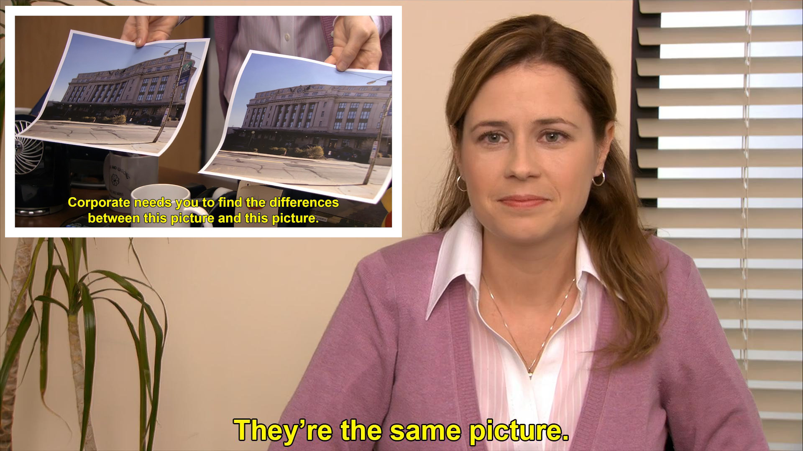
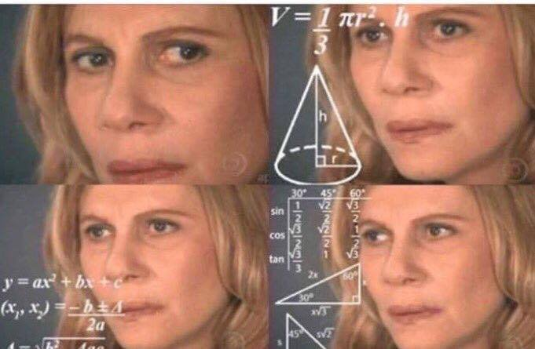
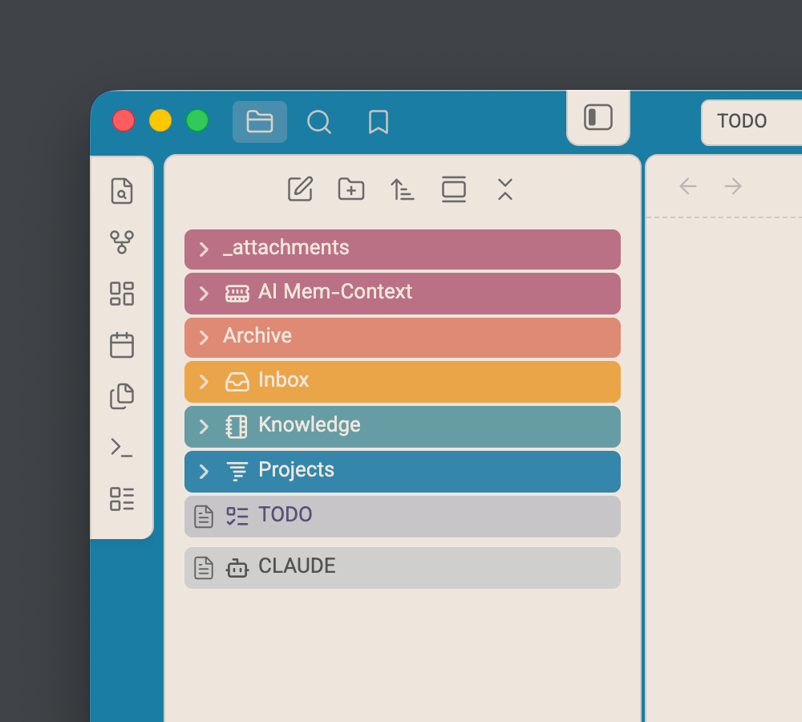
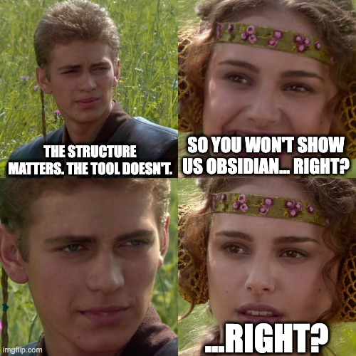
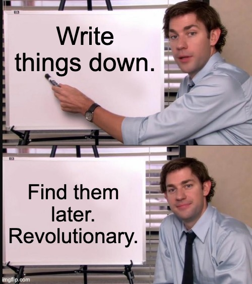

  

  <h1 style="font-size: 3rem; margin-top: 0.75rem; margin-bottom: 0;">
    Taming Your Digital Life
  </h1>
  
Ali Irani · OVOU Spotlight · April 28, 2026

<!--
Keep it calm. Just start.
-->

---
layout: center
---

  

    How many of you have saved something, 
    forgot about it, and then saved 
    the exact same thing again two weeks later?
  

  

<!--
Pause. Look at the camera. Let it land.

Everyone in the room will nod. Don't rush to the answer.
-->

---
layout: center
---

  

    It's not a memory problem.
  

  

    It's a system problem.
  

  

  

    Slack, WhatsApp, browser bookmarks, Apple Notes, Google Docs, 
    email, a starred message from 2022, a screenshot you'll "deal with later", 
    and a folder called Misc with 847 items.
  

<!--
"We make saving easy and finding impossible. That's the real problem."
-->

---

  <h1>The PARA Method</h1>

by Tiago Forte — this is what changed how I think about organization

  
The idea is simple: <strong>stop deciding where things go in the moment.</strong>

  
Everything goes into an <strong>Inbox</strong> first. Then, when you have time, you move things to one of four places:

  

    
P

    
Projects

    
Active work

  

  

    
A

    
Areas

    
Responsibilities

  

  

    
R

    
Resources

    
Reference material

  

  

    
A

    
Archive

    
Done

  

<!--
"Four categories. That's it. The magic is that you capture first and organize later. You're never stuck deciding where something goes while you're in the middle of something else."
-->

---
layout: center
---

  

    "Where should I save this?" 
    is a decision you make 20 times a day.
  

  

  

    Every small decision drains energy. 
    An inbox removes the decision entirely.
  

<!--
"This is decision fatigue. The goal isn't to organize better — it's to remove the moment of friction entirely."
-->

---

  <h1>My story</h1>

  
Before, my notes lived in six different places. Notion for work, Chrome bookmarks for articles, WhatsApp for things friends shared, Apple Notes for random ideas, Google Docs for actual documents, Slack's saved items for things I meant to follow up on.

  
I saved everything and found nothing.

  
I tried PARA. It helped. But after a while I was still overthinking it — "Is this an Area or a Resource?" I once spent 11 minutes deciding where to put a pasta recipe. Eleven.

  

<!--
"So I simplified."
-->

---

  <h1>So I simplified</h1>

  

    
I dropped Areas. I merged Resources into Knowledge. Four folders:

    

      

        
📥 Inbox

        
Everything lands here.

      

      

        
🔨 Projects

        
Active work.

      

      

        
📚 Knowledge

        
AI, Health, Cooking...

      

      

        
📦 Archive

        
Done, but kept.

      

    

  

  

<!--
Show the screenshot here alongside the folders — real proof it's simple.
-->

---
layout: center
---

<!--
Let it breathe. Say nothing. Just smile.
-->

---
layout: center
---

  

    Start with a framework. 
    Hit friction. 
    Simplify. 
    Repeat.
  

  

  

    Don't wait for the perfect system — it doesn't exist. 
    The system you start today and fix next month 
    beats the one you're still designing.
  

<!--
"I've changed my system four or five times. That's not failure. That's the process. Your system is supposed to evolve — like your code, like your product. Ship it messy, improve it as you go."
-->

---

  <h1>Where AI comes in</h1>

  
The hardest part of any system is keeping it up. Life gets busy, you stop filing things, and it falls apart.

  
AI doesn't replace the system. It makes the system <strong>frictionless</strong>.

  

    
📥

    
Capture

    
Summarize and save without effort

  

  

    
🗂️

    
Organize

    
File and tag automatically

  

  

    
🔍

    
Retrieve

    
Find what you need, in context

  

<!--
"Garbage in, garbage out — same as always. But organized information in? That's where it gets powerful."
-->

---

  <h1>A real example</h1>

  
Last week I had to fill a performance review form. I had one hour.

  

    
Without a system

    

      I'd be digging through months of Slack messages, ClickUp history, old meeting notes — trying to remember what I actually did. Takes hours. You still miss half of it.
    

  

  

    
With the system

    

      I asked my AI to help me fill the form from my notes. It pulled from my meeting notes, project logs, things I'd captured over time. Done in 20 minutes.
    

  

<!--
"The AI didn't do the work for me. My past self did. The AI just surfaced it."
-->

---
layout: center
---

<!--
Let it land. Say nothing.
-->

---
layout: center
---

  

    You don't need Obsidian. 
    You don't need AI. 
    You need one inbox.
  

  

  

    
1.Pick any app you already use

    
2.Create an Inbox folder. Throw everything in for a week.

    
3.Notice what categories show up naturally

    
4.Build folders around those — not around a theory

    
5.If it feels complex, <strong class="accent">simplify</strong>

  

  
The best system is the one you actually keep using.

<!--
"That's it. You can start today, right after this call. One inbox. See what happens."
-->

---
layout: center
---

  

  
Questions?

  
Ali Irani · OVOU Spotlight

  

  
Stay in touch &mdash;

  

    <a href="https://aliirani.com/?utm_source=talk&utm_medium=slides&utm_campaign=second-brain" style="color: #0d9488; text-decoration: none; font-weight: 600;">aliirani.com</a>
    &middot;
    <a href="https://www.linkedin.com/in/aliirani" style="color: #0d9488; text-decoration: none; font-weight: 600;">linkedin.com/in/aliirani</a>
  

<!--
Open floor. Keep it light. Mention the links casually if asked where to follow up.
-->
